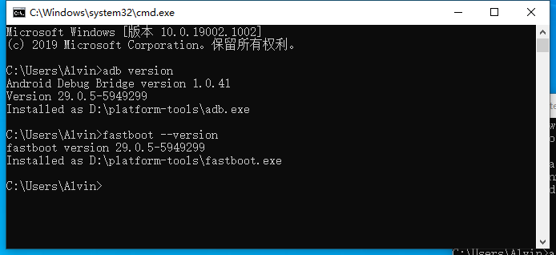

## Chapter 1 - 安装 adb 与 fastboot

在这里教大家刷机最基础的前提条件，安装与使用 adb 与 fastboot

### 什么是 adb ?

adb 全称为 Android Debug Bridge (Android 调试桥)，是可以让你在电脑与设备之间的通讯开发工具。具体怎么样我也不知道啦，反正我用 adb 主要就是来推拉文件开 shell XD。

通过 ``adb help`` 命令便可查看大部分命令的用途。在最后我将会介绍一些比较常用的 adb 命令。

### 什么是 fastboot ？

fastboot 是用于对 Android 设备分区进行刷写擦除操作的工具，它也可以让设备使用自定义的 Kernel 映像来启动。

说的不明不白，总之就是对分区操作，然后也可以直接 boot img 文件让手机用自定义内核启动。

通过 ``fastboot -h`` 命令便可查看大部分命令的用途。

### 安装 adb 与 fastboot

许多用户使用 adb 与 fastboot 的方式或许是在程序所在文件夹 Shift 右键开一个 PowerShell 或命令提示符。或者是 Ctrl + R 运行 ``cmd`` 然后再使用 ``cd`` 命令切换到目标目录。

这样的方式未免有些麻烦，接下来将介绍在 Windows 系统下通过添加 PATH 环境变量实现直接调用 adb 的方法。

```
这里说的直接调用指的是无需再将当前路径切换至程序目录，或者手动指定路径去启动程序
比如：D:\platform-tools\adb.exe help
而是直接输入程序名称便可自动在 PATH 环境变量中的目录中寻找到目标程序执行。
比如：adb help
```

#### Windows 系统

1. 下载由 Google 为 Windows 系统提供的 platform-tools [压缩包](https://dl.google.com/android/repository/platform-tools-latest-windows.zip)

   > platform-tools 是 Android SDK 的一个组件。它包含与 Android 平台进行交互的工具。
   >
   > 所以 adb 和 fastboot 是里面的一部分。
   >
   > 详细内容请查阅：https://developer.android.com/studio/releases/platform-tools

2. 将压缩包内的 platform-tools 文件夹解压至某处，比如 D:\platform-tools

   

3. 在桌面右击「计算机」，点击「属性」

4. 在左侧菜单选择「高级系统设置」

5. 在弹出的「系统属性」窗口中，点选「高级」选项卡，再点击下面「环境变量」按钮

6. 在「环境变量」窗口中，在「系统变量」那一栏找到变量名为 PATH 的一行，随后点击下面的编辑按钮。

   

7. 在「编辑环境变量」窗口中，点击「浏览」按钮，随后定位 platform-tools 的位置，再点击「确定」

   
   ```
   在老旧的 Windows 系统中可能并没有这么漂亮的列表框界面,只有一个文本框里面有一堆目录文本。此时你需要在最末尾处添加 ;D:\platform-tools 然后确定。（不要漏了最前面的分号！）
   ```

#### Linux 与 macOS

我觉得用这系统的应该都会比较熟悉了叭... 这里我就懒得解释了嘻嘻

### 使用 adb 与 fastboot 命令

完成上述操作后，你就可以直接通过 ``cmd`` 使用 adb 与 fastboot 工具了！

由于 adb 与 fastboot 是命令行工具，Windows 系统上需要使用 ``cmd`` 命令提示符来执行这两项命令。

```
并不是必须要在「命令提示符」内才可正确执行。只是因为它执行后的结果并不会通过图形窗口的方式展现给大家，在「命令提示符」内就可以看到它执行后输出的结果...
了解 Shell/Terminal 相关知识的应该知道我在讲什么，大家也可以自行去搜索一下2333
```

1. 按下「Windows 徽标 + R」键，在「运行」窗口中输入 ``cmd`` 并回车打开 「命令提示符」 
2. 在弹出的黑框框里面输入 ``adb version`` 查看 adb 版本，若能正确显示便安装成功！

3. 同样，输入 ``fastboot --version`` 查看 fastboot 版本，也是可以正常执行的。

   

之后我们要想使用 adb 与 fastboot 就是通过这种方式来使用啦！

```
随便提一嘴，请不要漏掉 adb 后面的空格！
adb 是程序名，以空格分割后面的为参数。
如：adb push pic.jpg /sdcard/
这条命令共有三个参数：push 为推送文件的指令；pic.jpg 是被推送的文件；/sdcard/ 是目标目录 (在这里为内置存储)
所以就是将当前目录的 pic.jpg 文件推送至设备的内置存储根目录下。
因为之前真的有见到过没看到空格就粘在一起打上去的情况，在这里就提醒一下...
```


### 关于驱动....

Windows 系统上 adb 驱动应该是自带的，而 fastboot 驱动理论上来说会由 Windows 联网自行安装。

所以这一块没啥好说的... 进入 fastboot 模式后让 Windows 自行搜索安装就 OK 了...

可以在「设备管理器」里面查看设备情况。


### 在手机上设置使用 adb 的环境

要想使用 adb ，你还需要在设备上的「开发者选项」内启用「USB 调试」功能。

1. 打开系统设置，选择「关于手机」
2. 连续快速点击「版本号」7 次，会出现「已开启开发者模式」的提示，若设置了锁屏密码你还需要验证才可开启。
3. 返回系统设置，点击「系统」，随后点击「开发者选项」
4. 往下滑动，找到「USB 调试」选项，然后开启！
5. 将手机连接至你的计算机。
6. 按照上面讲过的方式，执行 ```adb devices``` 命令查看正确连接的设备列表
7. 此时你的手机上应该会弹出一个「允许 USB 调试吗？」的弹窗，勾选「一律允许」的选择框，随后点击「允许」就 OK 了。
8. 此时，```cmd``` 内也应正常列出连接的设备列表。
   

若设备状态为「device」即为正常连接。

```
常见设备状态:
device 正常连接
unauthorized 未授权
recovery 设备处于 Recovery 模式
sideload 设备处于 sideload 线刷模式
offline 不在线
```

### 设置 fastboot

Fastboot 没有什么特别好说的，进入设备的 Fastboot 模式，让系统自动安装驱动就可以了。

进入手机的 Fastboot 模式后连接至电脑，直接使用 ```fastboot devices``` 查看设备列表就 OK 了。

> 以 OnePlus 7 Pro 举例：
>
> 关机状态下按住 音量键加 + 音量键减号 + 电源键，直到出现 OnePlus Logo 与 Fastboot Mode 的提示。
>
> 再执行上述命令。
>
> **注意！**是**两个音量键**一起按啊！！！

### 常用的 adb 指令

- adb shell - 在设备中开一个 shell (就好像我们 Windows 的 cmd)

- adb connect <IP 地址> - 通过 USB 网络调试连接设备（有些手机需要 root 权限以及额外的 App）

- adb push <本地文件> <目标文件> - 将 <本地文件> 推送至设备的 <目标文件>

  如 adb push D:\a.png /sdcard/ - 将 D:\a.png 推送至设备存储根目录。

- adb pull <目标文件> <本地文件> - 将设备 <目标文件> 拉取到 <本地文件>。如果 <本地文件> 未指定，则拉取到当前文件夹。

- adb logcat - 实时查看设备日志。

- adb install <APK文件> - 将 APK 安装包安装到设备上。

更多命令用法查看 ``adb help``

### 常用的 fastboot 指令

Fastboot 指令其实不是很常用，一般情况下只是用来启动自定义 Kernel (比如 TWRP)，通常接下来的刷机操作我们是直接在 TWRP 进行的了。但是这里就随便说几条。

- fastboot flash <分区>  - 将文件系统 IMG 映像文件刷入分区
- fastboot boot <Kernel IMG 文件> - 使用自定义的 Kernel 映像文件作为内核启动设备
- fastboot --set-active-slot=a - 将当前槽位设置为 a，(A/B 分区设备)
- fastboot oem unlock/lock - 解锁(unlock)或锁定(lock) 设备 Bootloader（不是所有手机都可以这样解锁！）

### 常见问题

没怎么遇到过，看看大家的反馈，有的我再加上去嘻嘻～！