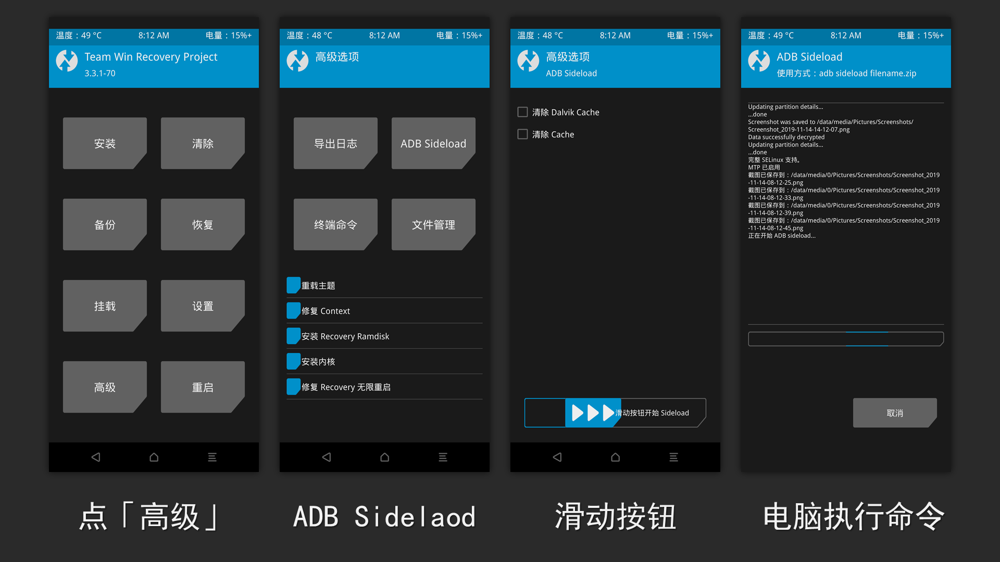

### 本章节内容

本章将教大家去解锁 OnePlus 7 Pro 的 Bootloader，介绍 TWRP 的使用，通过它来安装 Magisk。

还会介绍如何在 OTA 升级后保留 Magisk；如何卸载 Magisk 以及重新上锁 Bootloader...

(讲那么多真的好吗... 真的不用分章节吗...)

>由于酷安图文不支持 Markdown 语法，为了让大家能够迅速找到想看的内容，我使用了一些 Emoji 作为标识：
>
>💥：节点标题
>
>🌟：操作步骤
>
>📝：一些较为详细的解释，只想要了解步骤的可以忽略。
>
>⚠️：注意事项

### 💥需要的文件

>OnePlus 7 Pro 机型适用的 TWRP 映像：
>
>Android P：https://www.lanzous.com/i7c93ta 
>
>Android 10：https://www.lanzous.com/i7c9bwb
>
>以上资源来自 XDA 论坛用户  [mauronofrio](https://forum.xda-developers.com/member.php?u=4712355)，原帖： https://forum.xda-developers.com/oneplus-7-pro/development/recovery-unofficial-twrp-recovery-t3931322 
>
>Magisk v20.1 安装包： https://www.lanzous.com/i7c9mqb 
>
>可以前往官方 GitHub 页面下载：https://github.com/topjohnwu/Magisk/releases 

### 💥解锁 BootLoader (以下简称 BL)

绝大多数手机在刷机之前所需要进行的操作就是解锁 BL。

**⚠️注意！**OnePlus 7 Pro 在解锁后 Widevine DRM 等级将会降至 L3！(Netflix 无法观看高清视频)

>#### 📝Bootloader 是什么？
>
>我们通常所说的 Bootloader (接下来简称 BL) 指的是 Android Bootloader，这说明还有其他的 BL 存在。在此我们姑且不提，或许会在未来不知道存不存在的「附录篇」略微讲一下。
>
>BL 主要负责在设备上启动内核，我们开机的时候就会启动 boot 分区中存在的内核，进而启动 Android 系统。
>
>为了避免因为非官方固件使设备受到损害，通常设备厂商会对 BL 进行上锁 (Lock)，防止第三方固件刷写到设备分区中。而为了解开这一限制，我们则需要对其进行解锁 (Unlock)。
>
>我们所说的给手机刷机本质上就是对设备系统分区的刷写操作（如 system, vendor 分区）。解锁后便可使用 fastboot 工具对分区刷写，或者启动自定义内核（比如 TWRP）
>
>**⚠️解锁 Bootloader 会清除手机所有数据！请务必在解锁前将数据妥善备份！**

本文大部分操作因需要使用到 adb 与 fastboot 命令。

⚠️在此假设你已经查阅了本系列教程的上一章：[「安装 adb 与 fastboot」](https://github.com/yeyaowei/guacamole-simple-flashing-guide/blob/master/chapter-1-installing-adb-fastboot.md)，或者你已经熟悉了上述工具的使用。

##### 🌟操作步骤：

1. 进入系统设置 -> 系统 -> 开发者选项，打开「USB 调试」「OEM 解锁」选项

3. 执行 ``adb reboot bootloader`` ，手机将会重启至 Fastboot 模式

4. 在 Fastboot 模式下，执行 ``fastboot flashing unlock`` 命令，手机将会对你解锁 Bootloader 的操作进行确认！使用音量键选中第二个选项。再按下电源键将会清除设备数据并解锁！

5. 解锁完成后，设备会自动重启，你可以重新返回至「开发者选项」查看 BL 解锁状态。

  

在解锁 BL 后，你或许会注意到：以后每次设备开机都会在一个充满文字的画面停留一段时间，才会继续开机。这是由于 BL 解锁后处于安全考虑的警告，解锁就意味着你的固件安全性不能得到保证！

至此，解锁 BL 的步骤就完成了！现在我们可以通过 Fastboot 模式对设备分区任意刷写了！这也将正式开启我们的刷机之旅...

### 💥TWRP 的使用

要想刷入自定义固件的卡刷包，我们还需要使用第三方 Recovery TWRP 来帮我们完成。

>#### 📝TWRP 是什么？
>
>TWRP 全程 Team Win Recovery Project，~~中文名是「胜利队恢复计划」。~~
>
>它是一种恢复模式固件 (Recovery)，允许用户刷入自定义的设备固件、分区操作等等功能。你可以在这里看到更多信息： https://twrp.me/faq/whatistwrp.html
>
>#### 📝什么是 Recovery？
>
>首先讲讲 Recovery 模式，这个模式是用于在 Android 设备安装 OTA 更新包，执行恢复出厂设置的模式。一般厂商官方的 Recovery 只可用于安装官方的 OTA 升级包，无法刷入自定义固件，所以我们需要第三方的 Recovery。
>
>#### 📝升级包和卡刷包又有个什么关系？
>
>升级包和卡刷包其实就是一个东西，如果你使用压缩软件打开一个非 A/B 分区设备的 OTA 升级包，和一个我们常见的卡刷包，你会发现里面都有路径为 `/META-INF/com/google/android/update-binary` 的文件，这个就是 Recovery 判断是不是合法卡刷包的一个依据。随后就会解析卡刷包内的脚本执行一系列操作对分区进行修改等目的...
>
>官方 Recovery 之所以无法刷机... `TODO`

紧接着我们就来使用 Magisk 来 root 我们的设备吧！

Magisk 的安装主要有两种方法：

第一种是提取当前 ROM 的 boot 映像 (内核 Kernel + Ramdisk)，使用 Magisk Manager 对其进行补丁处理，然后再将处理后的 boot 映像通过 ``fastboot flash boot patched_boot.img`` 刷入设备。

第二种是通过第三方 Recovery，刷入 Magisk 的安装包自动处理，然后直接重启即可。

在这里我将介绍第二种方式~

#### 💥启动 TWRP

1. 你可以看到下载下来的压缩包里面有一个后缀名为 IMG 的文件，我们将它解压至某处。

2. 将手机再次重启至 Fastboot 模式，并连接至电脑。

3. 进入 Fastboot 模式后，执行 `fastboot boot D:\twrp.img`，请将 `D:\twrp.img` 自行替换成解压出来的 IMG 文件路径，你可以使用拖拽的方式直接将文件拖到命令行窗口，它会自动将路径填写在上面。

4. 不出意外的话，手机屏幕会转变成 OnePlus Logo + Fastboot Mode 文本的画面，但过一会儿他就会进入到 TWRP 的界面了。

5. 如果手机设置了(锁屏密码)，需要输入密码才可访问 data 分区 (数据及你的存储文件)

6. 出现一个 Keep System Read only? 的询问界面，在这里将最下面的滑块滑动到最右。

7. 此时 TWRP 已经进入到了主界面，你还可以选择进入 Settings -> Language 设置中文语言。

   

#### 💥使用 TWRP 刷入安装包

使用 TWRP 刷入安装包有两种方式，在这里我们以 Magisk 为例...

##### 💥从存储空间刷入 Zip 包

1. 在 TWRP 模式下，同样可以像正常系统那样，使用 MTP 将文件传输至手机存储，这里我们将 Magisk 安装包放进去...

2. 当然，你也可以使用我们上一章学到的内容，使用 `adb push Magisk.zip /sdcard` 将安装包传入内置存储...

3. 一切妥当后，我们点击主界面上的「安装」，会进入到选择文件的界面，选择我们刚才放入的 Magisk 安装包...

4. 滑动下面的刷入条，确认刷入！

   `TODO 这里应该有图片`

##### 💥使用 Sideload 线刷模式刷入

这个模式一般是在 Data 分区不可访问(比如你刚格式化完)，或者是你懒得把安装包放进去的情况使用。

只需通过一条 adb 命令就可以自动地将安装包推送到设备并安装。

1. 点击 TWRP 主界面的「设置」，再点击右上角的「ADB Sideload」
2. 此时设备就处于 Sideload 模式下了，使用 `adb devices` 可以看到设备模式处于 `sideload`
3. 执行命令 `adb sideload <安装包路径>` 就会去安装了...

#### 怎么样算安装成功了？

标题栏上面有写哇...

安装包多种多样，全靠作者自己写，一般情况下安装成功的话 TWRP 都会提示安装成功，也就是无任何错误输出...

如果有错误的话一般都会以红色字体输出

>⚠️和别人反馈错误的时候请不要只说错误码！！直接把整个输出内容截图最靠谱！！！
>
>是的，TWRP 也可以用「下音量键 + 电源键」截图！保存在 ``/sdcard/Pictures/Screenshots``

### 安装 Magisk

emmm，如果你仔细看的话，应该已经学会了吧？

按照上面的教程，直接安装 Magisk 的卡刷包吧！

### 常见问题

#### 我启动一次 TWRP 之后，以后不可以直接用音量键 + 电源键 启动 TWRP 吗？

`TODO`