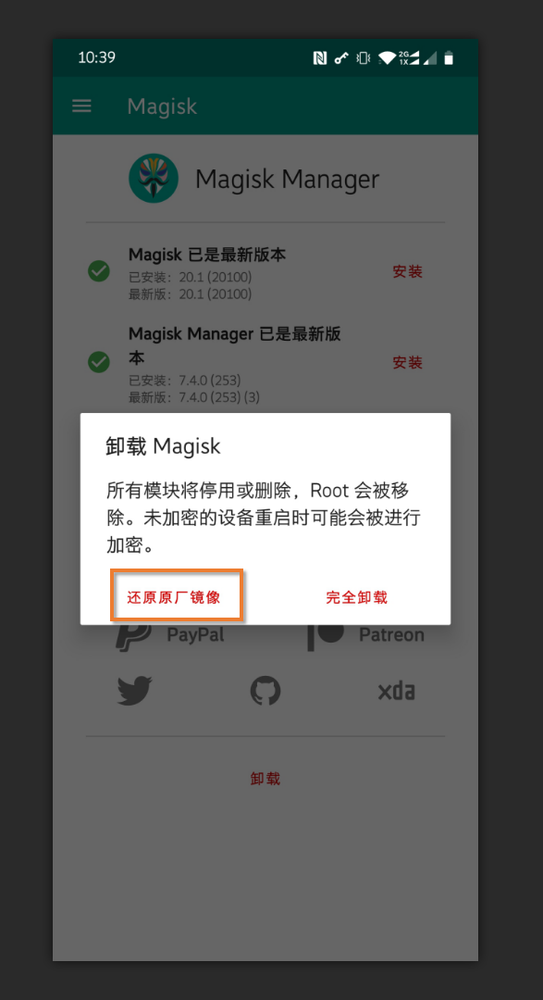

### 本章节内容

本章将教大家去解锁 OnePlus 7 Pro 的 Bootloader，介绍 TWRP 的使用，通过它来安装 Magisk 获取 root 权限。

还会介绍如何在 OTA 升级后保留 Magisk；如何卸载 Magisk 以及重新上锁 Bootloader...

(讲那么多真的好吗... 真的不用分章节吗...)

>由于酷安图文不支持 Markdown 语法，为了让大家能够迅速找到想看的内容，我使用了一些 Emoji 作为标识：
>
>💥：节点标题
>
>🌟：操作步骤
>
>📝：一些较为详细的解释，只想要了解步骤的可以忽略。
>
>⚠️：注意事项

### 💥需要的文件

>OnePlus 7 Pro 机型适用的 TWRP 映像：
>
>Android P：https://www.lanzous.com/i7c93ta 
>
>Android 10：https://www.lanzous.com/i7c9bwb
>
>以上资源来自 XDA 论坛用户  [mauronofrio](https://forum.xda-developers.com/member.php?u=4712355)，原帖： https://forum.xda-developers.com/oneplus-7-pro/development/recovery-unofficial-twrp-recovery-t3931322 
>
>Magisk v20.1 卡刷包： https://www.lanzous.com/i7c9mqb 
>
>可以前往官方 GitHub 页面下载：https://github.com/topjohnwu/Magisk/releases 

### 💥解锁 BootLoader (以下简称 BL)

绝大多数手机在刷机之前所需要进行的操作就是解锁 BL。

**⚠️注意！**OnePlus 7 Pro 在解锁后 Widevine DRM 等级将会降至 L3！(Netflix 无法观看高清视频)

>#### 📝Bootloader 是什么？
>
>我们通常所说的 Bootloader (接下来简称 BL) 指的是 Android Bootloader，这说明还有其他的 BL 存在。在此我们姑且不提，或许会在未来不知道存不存在的「附录篇」略微讲一下。
>
>BL 主要负责在设备上启动内核，我们开机的时候就会启动 boot 分区中存在的内核，进而启动 Android 系统。
>
>为了避免因为非官方固件使设备受到损害，通常设备厂商会对 BL 进行上锁 (Lock)，防止第三方固件刷写到设备分区中。而为了解开这一限制，我们则需要对其进行解锁 (Unlock)。
>
>我们所说的给手机刷机本质上就是对设备系统分区的刷写操作（如 system, vendor 分区）。解锁后便可使用 fastboot 工具对分区刷写，或者启动自定义内核（比如 TWRP）
>

**⚠️解锁 Bootloader 会清除手机所有数据！请务必在解锁前将数据妥善备份！**

本文大部分操作因需要使用到 adb 与 fastboot 命令。

⚠️在此假设你已经查阅了本系列教程的上一章：[「安装 adb 与 fastboot」](https://github.com/yeyaowei/guacamole-simple-flashing-guide/blob/master/chapter-1-installing-adb-fastboot.md)，或者你已经熟悉了上述工具的使用。

##### 🌟操作步骤：

1. 进入系统设置 -> 系统 -> 开发者选项，打开「USB 调试」「OEM 解锁」选项

3. 执行 ``adb reboot bootloader`` ，手机将会重启至 Fastboot 模式

4. 在 Fastboot 模式下，执行 ``fastboot flashing unlock`` 命令，手机将会对你解锁 Bootloader 的操作进行确认！使用音量键选中第二个选项。再按下电源键将会清除设备数据并解锁！

5. 解锁完成后，设备会自动重启，你可以重新返回至「开发者选项」查看 BL 解锁状态。

  

在解锁 BL 后，你或许会注意到：以后每次设备开机都会在一个充满文字的画面停留一段时间，才会继续开机。这是由于 BL 解锁后处于安全考虑的警告，解锁就意味着你的固件安全性不能得到保证！

至此，解锁 BL 的步骤就完成了！现在我们可以通过 Fastboot 模式对设备分区任意刷写了！这也将正式开启我们的刷机之旅...

### 💥TWRP 的使用

要想刷入自定义固件的卡刷包，我们还需要使用第三方 Recovery TWRP 来帮我们完成。

>#### 📝TWRP 是什么？
>
>TWRP 全程 Team Win Recovery Project，~~中文名是「胜利队恢复计划」。~~
>
>它是一种恢复模式固件 (Recovery)，允许用户刷入自定义的设备固件、分区操作等等功能。你可以在这里看到更多信息： https://twrp.me/faq/whatistwrp.html
>
>#### 📝什么是 Recovery？
>
>首先讲讲 Recovery 模式，这个模式是用于在 Android 设备安装 OTA 更新包，执行恢复出厂设置的模式。一般厂商官方的 Recovery 只可用于安装官方的 OTA 升级包，无法刷入自定义固件，所以我们需要第三方的 Recovery。
>
>#### 📝升级包和卡刷包又有个什么关系？
>
>升级包和卡刷包其实就是一个东西，如果你使用压缩软件打开一个非 A/B 分区设备的 OTA 升级包，和一个我们常见的卡刷包，你会发现里面都有路径为 `/META-INF/com/google/android/update-binary` 的文件，这个就是 Recovery 判断是不是合法卡刷包的一个依据。随后就会解析卡刷包内的脚本执行一系列操作对分区进行修改等目的...
>

#### 💥启动 TWRP

1. 你可以看到下载下来的压缩包里面有一个后缀名为 IMG 的文件，我们将它解压至某处。

2. 将手机再次重启至 Fastboot 模式，并连接至电脑。

3. 进入 Fastboot 模式后，执行 `fastboot boot D:\twrp.img`，请将 `D:\twrp.img` 自行替换成解压出来的 IMG 文件路径，你可以使用拖拽的方式直接将文件拖到命令行窗口，它会自动将路径填写在上面。

4. 不出意外的话，手机屏幕会转变成 OnePlus Logo + Fastboot Mode 文本的画面，但过一会儿他就会进入到 TWRP 的界面了。

5. 如果手机设置了(锁屏密码)，需要输入密码才可访问 data 分区 (数据及你的存储文件)

6. 出现一个 Keep System Read only? 的询问界面，在这里将最下面的滑块滑动到最右。

7. 此时 TWRP 已经进入到了主界面，你还可以选择进入 Settings -> Language 设置中文语言。

   

#### 💥使用 TWRP 刷入卡刷包

使用 TWRP 刷入卡刷包有两种方式。

##### 💥从存储空间刷入 Zip 卡刷包包

1. 在 TWRP 模式下，同样可以像正常系统那样，使用 MTP 将文件传输至手机存储，这里我们将 Zip 格式的卡刷包放进去...

2. 当然，你也可以使用我们上一章学到的内容，使用 `adb push Magisk.zip /sdcard` 将卡刷包传入内置存储...

3. 一切妥当后，我们点击主界面上的「安装」，会进入到选择文件的界面，选择我们刚才放入的 Zip 卡刷包...

4. 滑动下面的刷入条，确认刷入！

   

##### 💥使用 Sideload 线刷模式刷入

这个模式一般是在 Data 分区不可访问(比如你刚格式化完)，或者是你懒得把安装包放进去的情况使用。

只需通过一条 adb 命令就可以自动地将安装包推送到设备并安装。

1. 点击 TWRP 主界面的「设置」，再点击右上角的「ADB Sideload」
2. 此时设备就处于 Sideload 模式下了，使用 `adb devices` 可以看到设备模式处于 `sideload`
3. 执行命令 `adb sideload <安装包路径>` 就会去安装了...

#### 💥怎么样算安装成功了？

标题栏上面有写哇...

安装包多种多样，全靠作者自己写，一般情况下安装成功的话 TWRP 都会提示安装成功，也就是无任何错误输出...

如果有错误的话一般都会以红色字体输出

>⚠️和别人反馈错误的时候请**不要**只说**错误码**！！直接把整个输出内容截图最靠谱！！！
>
>是的，TWRP 也可以用「下音量键 + 电源键」截图！保存在 ``/sdcard/Pictures/Screenshots``

### 💥安装 Magisk

>#### 📝Magisk 是什么？
>
>许多人想到 Magisk 一般都是，可以安装很多模块对系统自定义修改，可以实现 root 权限。实际上也差不多是这样。
>
>Magisk 提供了一套解决方案对 Android 进行一定程度的自定义修改。除了最基础的提供获取 root 权限的方式意外，它还提供了一个 Systemless 的接口，实现不触碰 system、vendor 等分区的情况下修改对应分区。
>
>乍一看好像有点矛盾啊？不能碰到分区又要达到修改的目的？
>
>它的操作大概可以想象成，在启动的时候 Magisk 会创建一个虚拟分区，里面是对应要修改分区的镜像。然后把要修改的操作都在这个虚拟分区里面进行。弄好之后，把真正的分区从对应的挂载点上撤下来，换上虚拟的那一个。
>
>#### 📝如果不动系统分区的话，它安装到哪了？
>
>答案是 boot 分区！Android 系统本来是要首先加载 system 分区里面的 init 进程来启动的，但是 Magisk 安装在 boot 分区后，就会强制系统先启动 boot 分区里面的 Magisk 自己的 init，让 Magisk 有机会做一些操作，然后再在去加载原本系统应该要用的 init。
>
>(大概是这样的，不完全正确，详细的话复杂得多...)

那么如何安装 Magisk，root 我们的设备呢...？

emmm，如果你仔细看的话，应该已经学会了吧？

所以这里是个人实践时间！

按照上面的教程，下载文章开头提供的 Magisk 卡刷包，直接刷入重启吧！

完成之后，你的系统应该会多出一个 App 叫做 Magisk Manager (图标是一个脸谱的样子)

打开就可以查看当前 Magisk 的安装状态啦！

### 💥卸载 Magisk

卸载 Magisk 也是很简单的...

进入 Magisk Manager，点击「卸载」，会出现两个选项。

分别是「还原原厂镜像」「完全卸载」

这两个的区别就是第一个会保留你的 Magisk 模块，下次你再安装的话模块还在...

第二个就是字面意思，完全卸载咯...

选个你想要的，然后按照说明就可以卸载啦...

### 💥OTA 后保留 Magisk

一般 OTA 升级后官方都会用一个新的 boot 映像替换掉对应分区，看过上面的扩展阅读你会知道 Magisk 也是对 boot 分区做了一些操作的，那我 OTA 升级之后又要进 TWRP 重新刷一遍吗？

得益于 OnePlus 7 Pro 的 A/B 分区机制（未来章节会讲），设备将系统分成了 2 个分区，比如 `system_a`、`system_b`，同样我们的 boot 分区也有两个。我们当前运行的系统是这 A 与 B 之间的其中一个。

系统执行更新的时候，就会将新的系统安装在未使用的那一个分区，在下次启动后就会启动到另一个分区上。如果启动失败了也会回退到这个还没有更新的分区。这也是为什么我们的设备不像以前那些年那样，安装个更新就要重启到 Recovery 才能更新。现在更新系统的操作直接在运行的时候内部完成。

那这样的话，在 OTA 完成之后，我们同样直接把 Magisk 安装到未使用的那个分区就可以了！ 

接下来我就按照官方 Magisk 文档，为大家展示一下操作步骤...

##### 🌟操作步骤：

1. 首先去「开发者选项」禁用掉「系统自动更新」，避免在你未确认的情况下直接安装 OTA
2. 安装 OTA 之前，首先打开 Magisk Manager，点击「卸载」->「还原原厂镜像」。这样你的 boot 分区恢复到官方的版本。

   

1. 前往「系统更新」那里安装更新... 安装完之后**不要重启**！！！返回到 Magisk Manager，点击「安装」->「安装」->「安装到未使用的槽位（OTA 后）」，Magisk 就会安装到那个 OTA 更新的槽位。
   

2. 安装完成后，点击「重新启动」按钮，系统就会强制启动到那个 OTA 的槽位。你的更新安装好了，Magisk 还保留着哦！

   

### 💥卸载 Magisk 重新上锁 BL

唉，怀念看 Netflix 的时候，享受高清 1080P + HDR 画质的时光...

解锁之后一切都不复存在了...

我要 root 有什么用呢？刷什么机啊... 平平淡淡才是真...

所以，接下来我们来上锁吧...

**⚠️上锁 Bootloader 会清除手机所有数据！请务必在上锁前将数据妥善备份！**

****

##### 🌟操作步骤：

1. 首先要确保你的手机一切分区处于原厂状态！我的建议是直接安装一遍官方系统完整包！用 TWRP 装也是可以的！

2. 不想重新安一遍系统的话，起码要把 Magisk 先撤掉，进 Magisk Manager ->「卸载」->「完全卸载」，它会下载一个 Uninstaller 卸载包，然后就会帮你卸载掉了...

3. 然后连接电脑，用 `adb reboot bootloader` 进入 Fastboot 模式

4. 在 Fastboot 模式下，执行 `fastboot flashing lock` ，和解锁一样，手机将会对你上锁 Bootloader 的操作进行确认。使用音量键选中第二个选项，再按下电源键将会清除设备数据并重新上锁！

   

5. 一切完成重进系统，进入「开发者选项」把「OEM 解锁」关掉，这样别人就不能偷偷解锁拿去卖钱了...

### 💥常见问题

#### ❓ 我启动一次 TWRP 之后，以后不可以直接用「音量键 + 电源键」启动 TWRP 吗？

不可以呢... 因为这里只是临时将 TWRP 作为启动内核，如果看了上面关于 BL 的介绍就知道，下次启动还是会用 boot 分区里面提供的内核。虽然有办法将 TWRP 打补丁到 boot 分区里面去，但是在这里不是很推荐大家用：因为有很多奇奇怪怪的坑。临时用 TWRP 就可以了！身边没有电脑的情况下就不要随意刷机！

#### ❓ 我点「安装」看到里面的文件名都是乱码的...

？？？你怕不是开头要输入密码的那个界面输错了哦...

#### ❓ 安装 Magisk 的时候出错了...

那就把截图或者拍张照发过来哇。你不会想这么做的。

#### ❓ 如果我不卸载 Magisk 直接上锁 BL 会怎么样？

#### ❓ 我... 没问题了...

好像想不出什么常见问题了，有问题评论私信谢谢~

### 💥本章总结

看到这里，相信你已经学会了如何解锁你的 OnePlus 7 Pro 的 Bootloader，并且通过 fastboot 启动 TWRP，使用 TWRP 安装 Zip 卡刷包。同时利用上面的知识成功的安装了 Magisk 到手机上！

然后你也学会了更新之后怎么保留 Magisk，腻了怎么卸载和上锁。

就这样叭～